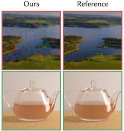
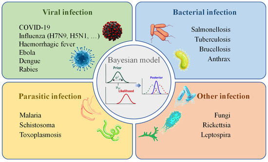
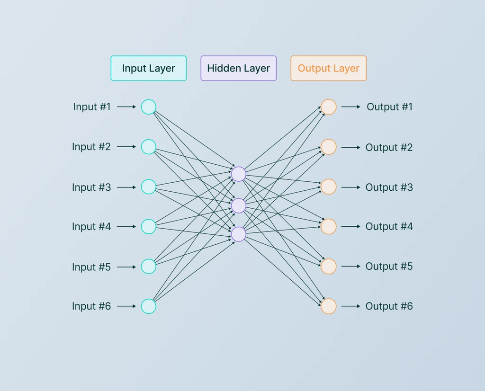

```{python}
#| include: false

from tree_markers import render_tree_marker
from trees import render_tree
```

# Course Map

- [](){.alert}
- []()
- []()
- []()
- []()

::: {.key-point}
Course details, schedule updates, assignments, and supporting materials are on
the [course website]().
:::

# What is Monte Carlo?

::: {.columns}
::: {.column width="36%"}
- Monte Carlo helps with uncertainty
- Why is there uncertainty?
- How is uncertainty expressed quantitatively?
- Are we there yet?
- Why participate synchronously?
:::

::: {.column width="64%"}
```{python}
#| echo: false
#| output: asis
print(
    render_tree(
        "mc",
        groups=["foundation", "methods", "practice"],
        show_group_headings=True,
        asset_base_url="../classlib/classlib/quarto/components/trees",
        width="100%",
        classes=["monte-carlo-at-a-glance-tree"],
    )
)
```
:::
:::

## Monte Carlo helps with uncertainty

::: {.columns style="text-align: center;"}
::: {.column width="33.33%"}
[Finance]{.alert}

[{fig-alt="Stock-market display"}](https://www.pexels.com/photo/numbers-on-monitor-534216/){.image-source target="_blank" rel="noopener" style="width: 95%;" title="View image source"}

:::

::: {.column width="33.33%"}
[Engineering]{.alert}

[{fig-alt="Hydraulic-fracturing water cycle and well diagram"}](https://d9-wret.s3.us-west-2.amazonaws.com/assets/palladium/production/s3fs-public/thumbnails/image/4Fraking42412-920.jpg){.image-source target="_blank" rel="noopener" style="width: 70%;" title="View image source"}

:::

::: {.column width="33.33%"}
[Image rendering]{.alert}

[{fig-alt="Ray-traced results compared with reference images"}](https://research.nvidia.com/publication/2023-05_recursive-control-variates-inverse-rendering){.image-source target="_blank" rel="noopener" style="width: 54%;" title="View image source"}

:::
:::

<div class="vspace-sm"></div>

::: {.columns style="text-align: center;"}
::: {.column width="33.33%"}
[Bayesian inference]{.alert}

{fig-alt="Bayesian inference visualization" style="width: 94%;"}

:::

::: {.column width="33.33%"}
[Neural networks]{.alert}

{fig-alt="Neural-network diagram" style="width: 71%;"}

:::

::: {.column width="33.33%"}
[Queues]{.alert}

{fig-alt="In-N-Out drive-through queue" style="width: 89%;"}

:::
:::


## Why is there uncertainty?

[]()


- Finance: [market forces]{.alert} often modeled by stochastic processes driven by Brownian motion
- Engineering: [system parameter variability]{.alert} modeled, for example, by Gaussian processes
- Image rendering: a [finite sample]{.alert} must stand in for all possible rays
- Bayesian inference: the [posterior probability distribution]{.alert} combines prior information and data
- Neural networks: [not every direction]{.alert} in parameter space can be searched
- Queues: customer [arrival and service times]{.alert} vary


## How is uncertainty expressed quantitatively?

\begin{align*}
Y&=
\text{random variable denoting } \alerttext{quantity of interest}
= \begin{cases}
\text{option payoff} \\
\text{fluid pressure} \\
\text{pixel intensity} \\
\text{statistical model parameter}\\
\text{neural-network parameter} \\
\text{service time}
\end{cases} \\
& = f(\vX), \text{ where} \\
\vX & = \text{multivariate random variable that is }\alerttext{easy to sample}
\end{align*}

- Generate [sample]{.alert} versions $Y_1,\ldots,Y_n$
- Use samples to estimate [population parameters]{.alert}:
  - mean
  - variance
  - quantile
  - probability distribution

## Are we there yet?

You are visiting a friend. The trip requires

- a 5-minute walk to the train,
- waiting for a train that arrives every 20 minutes,
- a 35-minute train ride,
- a taxi that is waiting with probability $0.2$,
- otherwise, a taxi wait with mean 10 minutes, and
- a 12-minute taxi ride.

::: {.key-point}
How long should you allow for the trip?
:::

The companion `AreWeThereYet` notebook is being migrated for Fall 2026.

## Why participate synchronously?

::: {.incremental}
- Keep pace with the course.
- Ask questions and receive answers in real time.
- Influence the pace and direction of discussion.
- Help classmates learn and benefit from their questions.
- Build a learning community and get to know one another.
:::

# Probability review {.tree-marker-slide}

- Random variables and distributions
- Discrete and continuous distributions
- Moments
- Binomial distribution
- Exponential distribution
- Multivariate normal distribution

```{python}
#| echo: false
#| output: asis

print(render_tree_marker("probability"))
```

## Random variables and distributions {.tree-marker-slide}

```{python}
#| echo: false
#| output: asis

print(render_tree_marker("probability"))
```

Let $Y$ be a random variable with sample space
$\mathcal{Y} \subseteq \reals$.

$$
\begin{aligned}
\Prob(Y\in\Omega)
  &:= \text{probability of the event }\Omega,\\
F(y)&:=\Prob(Y\le y), && y\in\mathcal{Y},\\
Q(p)&:=\inf\{y\in\mathcal{Y}:F(y)\ge p\}, && 0<p<1,\\
\Ex[g(Y)]&:=\int_{\mathcal{Y}}g(y)\,\dif F(y).
\end{aligned}
$$

$F$ is the [cumulative distribution function]{.alert}; $Q$ is the
[quantile function]{.alert}.

## Discrete and continuous distributions

::: {.columns}
::: {.column width="48%"}
### Discrete

The probability mass function is

$$
\rho(y):=\Prob(Y=y).
$$

$$
\Ex[g(Y)]
=\sum_{y\in\mathcal{Y}}g(y)\rho(y).
$$
:::

::: {.column width="48%"}
### Continuous

The probability density function satisfies

$$
\rho(y):=F'(y).
$$

$$
\Ex[g(Y)]
=\int_{\mathcal{Y}}g(y)\rho(y)\,\dif y.
$$
:::
:::

## Moments

For a scalar random variable $Y$,

$$
\mu:=\Ex(Y),\qquad
\sigma^2:=\var(Y)
=\Ex\bigl[(Y-\mu)^2\bigr].
$$

$\mu$ is the [mean]{.alert}, $\sigma^2$ the [variance]{.alert}, and $\sigma$
the [standard deviation]{.alert}.

For a $d$-dimensional random vector $\vY$ with mean $\vmu$,

$$
\cov(\vY)
:=\left(
\Ex\left[(Y_j-\mu_j)(Y_k-\mu_k)\right]
\right)_{j,k=1}^{d}.
$$

## Binomial distribution

For $Y\sim\Bin(n,p)$,

$$
\rho(y)=\Prob(Y=y)
=\binom{n}{y}p^y(1-p)^{n-y},
\qquad y=0,1,\ldots,n,
$$

$$
F(y)=\sum_{j=0}^{\lfloor y\rfloor}\binom{n}{j}p^j(1-p)^{n-j},
\qquad
Q(q)=\inf\{y\in\{0,\ldots,n\}:F(y)\ge q\}.
$$

$$
\Ex(Y)=np,
\qquad
\var(Y)=np(1-p).
$$

The Bernoulli distribution is the case $n=1$.
`scipy.stats.binom(n, p)`

## Exponential distribution

The exponential distribution models a memoryless waiting time. For
$Y\sim\Exp(\lambda)$,

$$
\rho(y)=
\begin{cases}
0, & y<0,\\
\lambda \me^{-\lambda y}, & y\ge 0,
\end{cases}
\qquad
F(y)=
\begin{cases}
0, & y<0,\\
1-\me^{-\lambda y}, & y\ge 0.
\end{cases}
$$

$$
Q(p)=-\frac{\log(1-p)}{\lambda},
\quad
\Ex(Y)=\frac{1}{\lambda},
\quad
\var(Y)=\frac{1}{\lambda^2}.
$$

`scipy.stats.expon(loc=0, scale=1/lambda)`

## Multivariate normal distribution

Used in finance and uncertainty quantification:

$$
\vY\sim\Norm(\vmu,\boldsymbol\Sigma),
$$

where $\vmu$ is the mean vector and $\boldsymbol\Sigma$ is the
covariance matrix. Its density is

$$
\rho(\vy)
=\frac{1}{(2\pi)^{d/2}\abs{\boldsymbol\Sigma}^{1/2}}
\exp\left(
-\frac{1}{2}(\vy-\vmu)^{\mathsf T}
\boldsymbol\Sigma^{-1}(\vy-\vmu)
\right).
$$

`scipy.stats.multivariate_normal(mean=mu, cov=Sigma)`

# From samples to estimates

- Sampling
- Under random sampling
- Central Limit Theorem
- Monte Carlo estimates of properties of $Y$
- Computational counterparts
- Are we there yet? Revisited

## Sampling

Let $Y$ be a random variable, often $Y=f(\vX)$, and let
$Y_1,\ldots,Y_n$ be a sample - not necessarily random or IID.

The [sample mean]{.alert} and [sample variance]{.alert} are

$$
\hmu_n:=\frac{1}{n}\sum_{i=1}^nY_i,
\qquad
\hsigma_n^2
:=\frac{1}{n-1}\sum_{i=1}^n(Y_i-\hmu_n)^2.
$$

## Under random sampling

Suppose $Y_1,Y_2,\ldots\IIDsim Y$, where
$\Ex(Y)=\mu$ and $\var(Y)=\sigma^2$.

$$
\Ex(\hmu_n)=\mu,
\qquad
\Ex(\hsigma_n^2)=\sigma^2.
$$

Thus both estimators are [unbiased]{.alert}. Moreover,

$$
\mse(\hmu_n)
=\Ex\left[(\mu-\hmu_n)^2\right]
=\frac{\sigma^2}{n},
\qquad
\rmse(\hmu_n)=\frac{\sigma}{\sqrt{n}}.
$$

## Central Limit Theorem

If $Y_1,Y_2,\ldots\IIDsim Y$ and $0<\sigma^2<\infty$,
then

$$
\frac{\hmu_n-\mu}{\sigma/\sqrt{n}}
\dto\Norm(0,1)
\qquad\text{as }n\to\infty.
$$

For large $n$,

$$
\hmu_n\appxsim
\Norm\left(\mu,\frac{\sigma^2}{n}\right).
$$

::: {.key-point}
Monte Carlo error for a sample mean typically decreases like $n^{-1/2}$.
:::

## Monte Carlo estimates of properties of $Y$

| Population quantity | Sample approximation |
|---|---|
| Mean $\mu$ | $\hmu_n$ and an approximate 99% interval $\hmu_n\pm2.58\hsigma_n/\sqrt n$ |
| Variance $\sigma^2$ | $\hsigma_n^2$ |
| CDF $F$ | Empirical distribution function $\hF_n$ |
| Quantile function $Q$ | Empirical quantile function $\widehat Q_n$ |
| Density or mass function $\rho$ | Histogram or kernel density estimate |

The mean has a natural interval estimate; the other rows commonly begin with
point estimates.

## Computational counterparts

| Quantity | Python tool |
|---|---|
| Mean | `np.mean(data)` |
| Variance | `np.var(data, ddof=1)` |
| Empirical CDF | `statsmodels.distributions.empirical_distribution.ECDF(data)` |
| Empirical quantile | `np.quantile(data, probabilities)` |
| Histogram | `np.histogram(data, bins="auto")` |
| Kernel density estimate | `scipy.stats.gaussian_kde(data)` |

## Are we there yet? Revisited

For the travel-time model,

1. model each uncertain waiting time,
2. generate independent trip times $Y_1,\ldots,Y_n$,
3. estimate the mean and relevant upper quantiles, and
4. report Monte Carlo uncertainty with the estimates.

::: {.key-point}
The question "How long should I allow?" is usually a quantile question, not
only a mean question.
:::

The companion `AreWeThereYet` notebook is being migrated for Fall 2026.

# Conditioning

- Conditional probability
- Laws of total expectation and variance
- Conditional Monte Carlo

## Conditional probability

For a random vector $(Y,Z)$,

$$
\Prob(Y=y\mid Z=z)
=\frac{\Prob(Y=y,Z=z)}{\Prob(Z=z)}
=\frac{\Prob(Z=z\mid Y=y)\Prob(Y=y)}
{\Prob(Z=z)}.
$$

The second equality is [Bayes' theorem]{.alert}. For densities,

$$
\rho_{Y\mid Z}(y\mid z)=\frac{\rho_{Y,Z}(y,z)}{\rho_Z(z)}.
$$

## Laws of total expectation and variance

$$
\Ex(Y)=\Ex_Z\bigl[\Ex(Y\mid Z)\bigr],
$$

$$
\var(Y)
=\Ex_Z\bigl[\var(Y\mid Z)\bigr]
+\var_Z\bigl(\Ex(Y\mid Z)\bigr).
$$

::: {.key-point}
Conditioning separates variation within a fixed $Z$ from variation in the
conditional mean across values of $Z$.
:::

## Conditional Monte Carlo

Let $Y=f(X_1,\ldots,X_d)$ and $Z=(X_2,\ldots,X_d)$. If

$$
g(Z):=\Ex(Y\mid Z)
$$

is available analytically, then

$$
\mu=\Ex(Y)=\Ex_Z[g(Z)],
\qquad
\var_Z(g(Z))\le\var(Y).
$$

Sampling $g(Z)$ instead of $Y$ can therefore reduce variance.

If the conditional density $h(y,Z):=\rho_{Y\mid Z}(y\mid Z)$ is available,

$$
\rho_Y(y)=\Ex_Z[h(y,Z)],
$$

so a probability density can itself be expressed as an expectation.

# Big ideas

::: {.incremental}
- Use sample quantities to estimate properties of a random variable whose
  distribution is difficult to obtain directly.
- Targets include means, variances, covariances, probability mass or density
  functions, cumulative distribution functions, and quantiles.
- For means, the CLT provides interval estimates that quantify Monte Carlo
  uncertainty.
- Other properties often begin with point estimates - one approximate value
  for each target.
- Conditioning can turn a difficult random quantity into a lower-variance
  expectation.
:::
