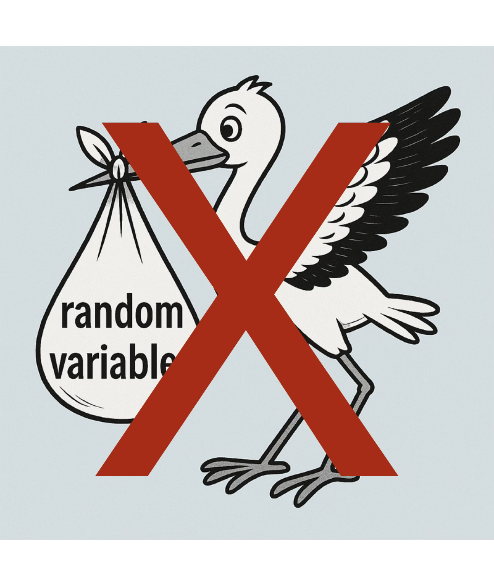

# Course Map

::: {.columns}
::: {.column width="45%"}
<h3>Course decks</h3>

- []()
- [](){.alert}
- []()
- []()
- []()
:::

::: {.column width="55%"}
<h3>In this deck</h3>

- [From uniformity to a target distribution](#from-uniformity-to-a-target-distribution)
- [Random vectors and stochastic processes](#random-vectors-and-stochastic-processes)
- [Low discrepancy sampling](#low-discrepancy-sampling)
- [Acceptance–rejection sampling](#acceptancerejection-sampling)
- [Big ideas](#big-ideas)
:::
:::

# From Uniformity to a Target Distribution {.tree-marker-slide tree-marker="random-generation"}

- [Where do random variables come from?](#where-do-random-variables-come-from)
- [The quantile transform](#the-quantile-transform)
- [Binomial random numbers](#binomial-random-numbers)
- [Zero-inflated exponential random numbers](#zero-inflated-exponential-random-numbers)

## Where do random variables come from? {.tree-marker-slide tree-marker="random-generation"}

::: {.columns}
::: {.column width="61%"}
- Algorithms generate sequences—typically in $[0,1]$—designed to mimic IID
  uniform random variables
- Pseudorandom number generators are tested so that their output [looks IID
  random]{.alert} in many demanding ways
- Parallel computation requires special care: streams must not overlap or
  [acquire unintended dependence]{.alert}
- [RANDU]{.alert} is a classic warning: simple-looking output can conceal
  severe higher-dimensional structure
- Physical generators may supply genuine randomness, but do not by themselves
  guarantee IID samples from the desired distribution
:::

::: {.column width="5%"}
:::

::: {.column width="34%"}
{fig-alt="A stork carrying a bag labeled random variable, crossed out with a large red X" style="width: 100%; clip-path: inset(7.9% 0 7.9% 0); margin: -7.9% 0;"}
:::
:::

::: {.key-point}
Uniform numbers are the raw material; a [transformation]{.alert} produces the
target distribution
:::

## The quantile transform {.tree-marker-slide tree-marker="random-generation"}

Most generators produce

$$
U_1,U_2,\ldots\ \IIDsim\ \Unif[0,1]
$$

For a target cumulative distribution function $F$, define

$$
Q(u):=\inf\{x\in\reals:F(x)\ge u\}
$$

Then $Q(u)\le x \iff u\le F(x)$

For $X:=Q(U)$

$$
\Prob(X\le x)=\Prob\{Q(U)\le x\}
=\Prob\{U\le F(x)\}=F(x)
$$

Thus $X\sim F$ and [IID uniform inputs yield IID target samples]{.alert}

## Binomial random numbers {.tree-marker-slide tree-marker="random-generation"}

Suppose $X\sim\Bin(3,0.6)$

::: {.binomial-transform-table}
| $x$ | $0$ | $1$ | $2$ | $3$ |
|:---|:---:|:---:|:---:|:---:|
| PMF $\varrho_X(x)$ | $0.4^3$ $=0.064$ | $3(0.6)(0.4^2)$ $=0.288$ | $3(0.6^2)(0.4)$ $=0.432$ | $0.6^3$ $=0.216$ |
| $x\in$ | $[0,1)$ | $[1,2)$ | $[2,3)$ | $[3,\infty)$ |
| CDF $F(x)$ | $0.064$ | $0.352$ | $0.784$ | $1$ |
| $u\in$ | $(0,0.064]$ | $(0.064,0.352]$ | $(0.352,0.784]$ | $(0.784,1]$ |
| Quantile $Q(u)$ | $0$ | $1$ | $2$ | $3$ |
:::

$F$ is [right-continuous]{.alert}; $Q$ is [left-continuous]{.alert}

E.g., $U_1=0.63$, $U_2=0.02$, and $U_3=0.47$ produce $X_1=2$, $X_2=0$, and $X_3=2$

::: {.exitem}
$\exstar$
If $u=0.70$, what value does the inverse transform produce? What about $u=0.90$?
:::

## Zero-inflated exponential random numbers {.tree-marker-slide tree-marker="random-generation"}

### CDF

Let $X$ be nonnegative with probability $p_0$ of being zero and otherwise an
exponential distribution with rate $\lambda$:

$$
\Prob(X=0)=p_0,
\qquad
X\mid X>0\sim\Exp(\lambda)
$$

Its CDF is

$$
F(x)=
\begin{cases}
0, & x<0,\\
p_0, & x=0,\\
p_0+(1-p_0)(1-\me^{-\lambda x}), & x>0
\end{cases}
$$

---

### Quantile

Inverting the CDF gives

$$
Q(u)=
\begin{cases}
0, & 0<u\le p_0,\\[0.4em]
-\dfrac{1}{\lambda}\log\!\left(\dfrac{1-u}{1-p_0}\right),
& p_0<u<1
\end{cases}
$$

::: {.exitem}
$\exstar$
Verify that $F\{Q(u)\}\ge u$ and identify where equality fails
:::

::: {.exitem}
$\exstar$
Define $T(u):=Q(1-u)$. Simplify $T$ and explain why $T(U)$ has the desired distribution for $U\sim\Unif(0,1)$ even though $T$ is not the quantile function. Why might $T$ be preferred to $Q$?
:::

::: {.key-point}
The generalized inverse handles [atoms and continuous pieces]{.alert} with one definition
:::

# Random Vectors and Stochastic Processes {.tree-marker-slide tree-marker="random-generation"}

- [Independent marginals](#independent-marginals)
- [Multivariate normal sampling](#multivariate-normal-sampling)
- [Cholesky factorization](#cholesky-factorization)
- [Gaussian processes](#gaussian-processes)
- [Brownian motion](#brownian-motion)
- [Geometric Brownian motion](#geometric-brownian-motion)
- [Option payoffs and prices](#option-payoffs-and-prices)

## Independent marginals {.tree-marker-slide tree-marker="random-generation"}

For $\vX=(X_1,\ldots,X_d)$ with [independent marginals]{.alert}

$$
\vX=\bigl(Q_1(U_1),\ldots,Q_d(U_d)\bigr),
\qquad
\vU\sim\Unif[0,1]^d
$$

where $Q_j$ is the quantile function of $X_j$

Store $n$ sampled vectors as an $n\times d$ array:

$$
\mX=
\begin{pmatrix}
X_{11} & X_{12} & \cdots & X_{1d}\\
\vdots & \vdots & & \vdots\\
X_{n1} & X_{n2} & \cdots & X_{nd}
\end{pmatrix}
$$

[Rows are samples; columns are coordinates]{.alert}

## Multivariate normal sampling {.tree-marker-slide tree-marker="random-generation"}

Let $\vZ\sim\Norm(\vzero,\mI_d)$ be a column vector of $d$ independent
standard normal random variables, so

$$
\Ex(\vZ)=\vzero,
\qquad
\Ex(\vZ\vZ^\mathsf{T})=\mI_d
$$

Define $\vX=\mA\vZ+\vmu$. Then

\begin{align*}
\Ex(\vX) &= \vmu,\\
\cov(\vX) &= \Ex\bigl[(\vX-\vmu)(\vX-\vmu)^\mathsf{T}\bigr]
 =\Ex(\mA\vZ\vZ^\mathsf{T}\mA^\mathsf{T})\\
 &=\mA\Ex(\vZ\vZ^\mathsf{T})\mA^\mathsf{T}
 =\mA\mA^\mathsf{T}
\end{align*}

Every [linear combination]{.alert} of the components of $\vX$ is normal. Therefore,
if $\mSigma=\mA\mA^\mathsf{T}$,

$$
\vX=\mA\vZ+\vmu\sim\Norm(\vmu,\mSigma)
$$

## Cholesky factorization {.tree-marker-slide tree-marker="random-generation"}

### Concrete example

For symmetric positive-definite $\mSigma$, Cholesky factorization gives a
[lower-triangular]{.alert} $\mA$ such that $\mSigma=\mA\mA^\mathsf{T}$

For

$$
\mSigma=\begin{pmatrix}3&-1\\-1&1\end{pmatrix},
\qquad
\mA=\begin{pmatrix}a_{11}&0\\a_{21}&a_{22}\end{pmatrix}
$$

matching the entries of $\mSigma=\mA\mA^\mathsf{T}$ gives

\begin{align*}
a_{11}^2&=3,
&a_{11}a_{21}&=-1,
&a_{21}^2+a_{22}^2&=1
\end{align*}

Hence

$$
a_{11}=\sqrt3,
\qquad a_{21}=-\frac1{\sqrt3},
\qquad a_{22}=\sqrt{\frac23},
\qquad
\mA=\begin{pmatrix}\sqrt3&0\\-1/\sqrt3&\sqrt{2/3}\end{pmatrix}
$$

---

### General $2\times2$ covariance

For

$$
\mSigma=
\begin{pmatrix}
\sigma_1^2 & \rho\sigma_1\sigma_2\\
\rho\sigma_1\sigma_2 & \sigma_2^2
\end{pmatrix},
\qquad
\mA=
\begin{pmatrix}
\sigma_1 & 0\\
\rho\sigma_2 & \sigma_2\sqrt{1-\rho^2}
\end{pmatrix}
$$

Different factorizations generate the [same distribution]{.alert} but may behave
[differently under low discrepancy sampling]{.alert}

## Gaussian processes {.tree-marker-slide tree-marker="probability"}

A Gaussian process is a random function whose values at [any finite collection
of inputs]{.alert} form a multivariate normal random vector

$$
g\sim\GP(\mu,K)
$$

means

\begin{align*}
\Ex[g(t)] &= \mu(t),\\
\Ex\bigl[\{g(t)-\mu(t)\}\{g(x)-\mu(x)\}\bigr] &= K(t,x)
\end{align*}

For inputs $t_1,\ldots,t_d$

$$
\bigl(g(t_1),\ldots,g(t_d)\bigr)^\mathsf{T}
\sim\Norm(\vmu,\mSigma),
\qquad
\Sigma_{jk}=K(t_j,t_k)
$$

## Brownian motion {.tree-marker-slide tree-marker="probability"}

### Definition

Brownian motion $B$ is the Gaussian process with

$$
\mu(t)=0,
\qquad
K(t,x)=\min(t,x),
\qquad t,x\ge0
$$

For $0=t_0<t_1<\cdots<t_d$

$$
\bigl(B(t_1),\ldots,B(t_d)\bigr)^\mathsf{T}
\sim\Norm(\vzero,\mSigma),
\qquad
\Sigma_{jk}=\min(t_j,t_k)
$$

The covariance structure implies [independent normal increments]{.alert}

---

### Covariance matrix and Cholesky factor

For $0<t_1<t_2<t_3$, let $\Delta t_1=t_1$ and
$\Delta t_j=t_j-t_{j-1}$. Then

$$
\mSigma=
\begin{pmatrix}
t_1&t_1&t_1\\
t_1&t_2&t_2\\
t_1&t_2&t_3
\end{pmatrix},
\qquad
\mA=
\begin{pmatrix}
\sqrt{\Delta t_1}&0&0\\
\sqrt{\Delta t_1}&\sqrt{\Delta t_2}&0\\
\sqrt{\Delta t_1}&\sqrt{\Delta t_2}&\sqrt{\Delta t_3}
\end{pmatrix},
\qquad
\mSigma=\mA\mA^\mathsf{T}
$$

[Each entry sums the increments shared by both times]{.alert}:

$$
(\mA\mA^\mathsf{T})_{jk}
=\sum_{\ell=1}^{\min(j,k)}\Delta t_\ell
=t_{\min(j,k)}
$$

In general, $A_{jk}=\sqrt{\Delta t_k}$ for $k\le j$ and $A_{jk}=0$ otherwise

---

### Sampling

Let $Z_1,\ldots,Z_d\ \IIDsim\ \Norm(0,1)$ and start from $B(t_0)=0$

$$
B(t_j)=B(t_{j-1})+\sqrt{t_j-t_{j-1}}\,Z_j,
\qquad j=1,\ldots,d
$$

Equivalently

$$
B(t_j)=\sum_{k=1}^j\sqrt{t_k-t_{k-1}}\,Z_k
$$

::: {.key-point}
The Cholesky construction is the familiar [cumulative-sum construction]{.alert} for Brownian motion
:::

## Geometric Brownian motion {.tree-marker-slide tree-marker="quant-finance"}

- $S_0$: initial asset price
- $r$: continuously compounded risk-free rate
- $\sigma$: volatility

Then

$$
S(t)=S_0\exp\!\left[\left(r-\frac{\sigma^2}{2}\right)t+\sigma B(t)\right]
$$

is a geometric Brownian motion model for the asset price

The correction [$-\sigma^2/2$]{.alert} ensures $\Ex[S(t)]=S_0\me^{rt}$ under the
risk-neutral model

## Option payoffs and prices {.tree-marker-slide tree-marker="quant-finance"}

Let $K$ be the strike price and $T$ the time to maturity

| Contract | Discounted payoff |
|:---|:---|
| European call | $\me^{-rT}\max\{S(T)-K,0\}$ |
| European put | $\me^{-rT}\max\{K-S(T),0\}$ |
| Arithmetic Asian call | $\me^{-rT}\max\left\{T^{-1}\int_0^T S(t)\,\dif t-K,0\right\}$ |

The fair price is the [expected discounted payoff]{.alert}

$$
\mu=\Ex(\text{discounted payoff})
$$

# Low Discrepancy Sampling {.tree-marker-slide tree-marker="low-discrepancy"}

- [What does low discrepancy mean?](#what-does-low-discrepancy-mean)
- [Low discrepancy sequences](#low-discrepancy-sequences)
- [Bias–variance decomposition](#biasvariance-decomposition)
- [Shrinkage estimators](#shrinkage-estimators)

## What does low discrepancy mean? {.tree-marker-slide tree-marker="low-discrepancy"}

Relaxing the requirement that $\vU_1,\ldots,\vU_n$ be IID allows carefully
constructed samples to cover $[0,1]^d$ more evenly

$$
\vU_1,\ldots,\vU_n\ \LDsim\ \Unif[0,1]^d
$$

The empirical distribution of the sample is close to the uniform distribution

[Discrepancy]{.alert} quantifies that difference; precise definitions come later

::: {.key-point}
Low discrepancy replaces independent placement by [deliberate coverage]{.alert}
:::

## Low discrepancy sequences {.tree-marker-slide tree-marker="low-discrepancy"}

Important families include

- digital sequences, especially Sobol' sequences
- lattice sequences
- Halton sequences
- Kronecker sequences

They are available in deterministic and randomized forms through SciPy and
[QMCPy](https://qmcpy.org/)

In software arrays rows correspond to samples and columns to coordinates

## Bias–variance decomposition {.tree-marker-slide tree-marker="stat-estim"}

Recall the [bias–variance decomposition from Deck 01](01-introduction.html#mean-squared-error-bias-and-variance):
for an estimator $\Theta$ of $\theta$,

\begin{align*}
\mse(\Theta)
&=\Ex[(\Theta-\theta)^2]\\
&=[\bias(\Theta)]^2+\var(\Theta)
\end{align*}

The identity is unchanged; the [source of randomness]{.alert} changes:

- An IID sample-mean estimator is unbiased and has positive variance
- A deterministic low discrepancy estimator has [no sampling variance]{.alert},
  but its deterministic error may be nonzero
- A randomized low discrepancy estimator has a sampling distribution, enabling
  [variance estimation]{.alert} while retaining improved space filling

## Shrinkage estimators {.tree-marker-slide tree-marker="stat-estim"}

Suppose $Y_1,\ldots,Y_n\ \IIDsim\ Y$, where

$$
\Ex(Y)=\mu,
\qquad \var(Y)=\sigma^2,
\qquad
\hmu_n=\frac1n\sum_{i=1}^nY_i
$$

For the estimator $\alpha\hmu_n$

$$
\mse(\alpha\hmu_n)
=(1-\alpha)^2\mu^2+\alpha^2\frac{\sigma^2}{n}
$$

::: {.exitem}
$\exstar$
Find the value of $\alpha$ that minimizes this MSE. Is the minimizing estimator unbiased?
:::

# Acceptance–Rejection Sampling {.tree-marker-slide tree-marker="random-generation"}

- [The acceptance–rejection algorithm](#the-acceptancerejection-algorithm)
- [Why acceptance–rejection works](#why-acceptancerejection-works)
- [Efficiency and method comparison](#efficiency-and-method-comparison)

## The acceptance–rejection algorithm {.tree-marker-slide tree-marker="random-generation"}

Suppose

- [Proposal distribution]{.alert}: $Z$ is easy to sample with density $\varrho_Z$
- [Target distribution]{.alert}: density $c\varrho$, with known $\varrho$ and
  possibly unknown $c>0$
- $\varrho(x)\le M\varrho_Z(x)$ [for all $x$]{.alert}

Repeat until a proposal is accepted:

1. Generate $Z\sim\varrho_Z$ and $U\sim\Unif[0,1]$ independently
2. Accept $Z$ as $X$ if

   $$
   U\le\frac{\varrho(Z)}{M\varrho_Z(Z)}
   $$

Otherwise reject $Z$ and try again

## Why acceptance–rejection works {.tree-marker-slide tree-marker="random-generation"}

For a small interval $\dif z$ around $z$

\begin{align*}
\Prob(Z\in\dif z,\text{ accept})
&=\varrho_Z(z)\dif z\,
  \frac{\varrho(z)}{M\varrho_Z(z)}\\
&=\frac{\varrho(z)}{M}\dif z
\end{align*}

[Conditioning on acceptance]{.alert} gives the [target density]{.alert}

$$
\varrho_{Z\mid\text{accept}}(z)
=\frac{\varrho(z)/M}{\Prob(\text{accept})}
=c\varrho(z),
\qquad
\Prob(\text{accept})=\frac{1}{Mc}
$$

## Efficiency and method comparison {.tree-marker-slide tree-marker="sampling"}

Obtaining $n$ accepted samples requires an [average of $nMc$ proposals]{.alert}

| Method | Main requirement | Compatible with low discrepancy? |
|:---|:---|:---:|
| Quantile transform $X=Q(U)$ | Quantile function $Q$ | Yes |
| Normal transform $\vX=\mA\vZ+\vmu$ | $\mSigma=\mA\mA^\mathsf{T}$ | Yes |
| Acceptance–rejection | $\varrho\le M\varrho_Z$ | With care |

::: {.key-point}
Choose a [proposal distribution]{.alert} close to the
[target distribution]{.alert} so that $Mc$ is near one
:::

# Big Ideas {data-state="goldborder" .tree-marker-slide tree-marker="prob-stat-est"}

- Start with uniform samples and transform them to the desired distribution
- The generalized inverse works for discrete and continuous distributions
- Independent marginal transforms do not create dependence; correlated normal
  vectors require a matrix factorization
- Gaussian-process sampling reduces finite collections of function values to
  multivariate normal sampling
- Low discrepancy points trade independent placement for more even coverage
- Bias and variance are distinct contributions to mean squared error
- Acceptance–rejection samples from an unnormalized density when a suitable
  proposal envelope is available
